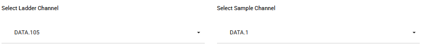
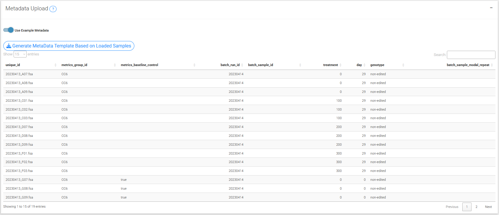
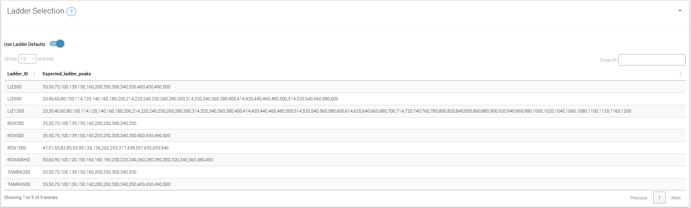

## STEP1: UPLOAD

### 1: Uploading data

Currently TRACE-shiny accepts only fsa files (raw file from the Genetic Analyzer instrument).

An example data set is available which consists a Huntington's disease cell line model with an unstable HTT repeat (refer to [our publication](https://www.nature.com/articles/s41467-024-47485-0)).

### 2: Select Data Channels
Data in fsa files are stored in different channels depending on the instrument setup. We show a plot that visualizes the signal in all the channels. You may need to use the drop down menu to visualize the signals in different samples if it is not clear.

Pick ladder and sample containing channels

In the drop down below, select the appropriate channels

-  Ladder: this signal is the internal base pair size standard. It is easily identifiable by the regular pattern of peaks. In the above example it is in the “DATA.105” channel.

-  Sample: the channel with the trace information for you samples should also be obvious with a distinctive trace pattern. In the above sample we can see a normal distribution of peaks in the DATA.1 channel.

### 3: Metadata
Metadata can be incorporated to allow additional functionality in repeat calling (correcting batch effects across fragment analysis runs) and index peak assignment (assigning index peak from another sample).

There are several important factors to a successful repeat instability experiment and things to consider when using this tool:

-   (required) Each sample has a unique id, usually the file name

-   (optional) Baseline control for your experiment. For example, specifying a sample where the modal allele is the inherited repeat length (eg a mouse tail sample) or a sample at the start of a time-course experiment. This is indicated with a `TRUE` in the `metrics_baseline_control` column of the metadata. Samples are then grouped together with the `metrics_group_id` column of the metadata. Multiple samples can be `metrics_baseline_control`, which can be helpful for the average repeat gain metric to have a more accurate representation of the average repeat at the start of the experiment.

-   (optional) There are two main correction approaches that are somewhat related: either 'batch' or 'repeat' in `call_repeats()`.

    -   Batch correction is relatively simple and just requires you to link samples across batches by indicating them from metadata. But even though the repeat size that is return will be precise, it will not be accurate and underestimates the real repeat length. This correction can be achieved by running a couple of samples in every fragment analysis run, or having a single run that takes a couple of samples from every run together, thereby linking them. These samples are indicated with batch_run_id (to group samples by fragment analysis run) and batch_sample_id (to enable linking samples across batches).

    -   By contrast, repeat correction can be used to accurately call repeat lengths (which also corrects the batch effects). However, the repeat correction will only be as good as your sample(s) used to call the repeat length.

        -   With how repeat correction works in this app, it's helpful to i) use the same samples across multiple runs (visualizations help you check that correction is consistent across runs), and ii) using multiple samples for correction for each run (helpful to help validate that each sample was called correctly).

        -   Similar to batch correction, batch_run_id (to group samples by fragment analysis run) and batch_sample_id (to enable linking samples across batches) are used, but importantly batch_sample_modal_repeat is also set. The batch_sample_modal_repeat is the validated repeat length of the modal repeat of the sample. This validated repeat length is then used to call the repeat length of the modal repeat for each sample (by each batch_run_id). Importantly, this correction requires you to know with confidence the repeat length of the modal peak of the sample. Therefore it's important that the sample used for repeat correction has a clear and prominent modal peak. If the repeat length is very long, it's common for the modal peak of a sample to change so if you use this feature you're going to have to understand the shape of the distribution of your sample and double check that the correct peak has been called as the modal peak. If the incorrect peak is called there are ways to visualize that correct that in this app.

Prepare a file (eg spreadsheet saved as .csv) with the following columns. Use the specified column names below:

| Metadata table column     | Functionality metadata is associated with                     | Description                                                                                                                                                                                                                                                                                                     |
|---------------------------|---------------------------------------------------------------|-----------------------------------------------------------------------------------------------------------------------------------------------------------------------------------------------------------------------------------------------------------------------------------------------------------------|
| unique_id                 | Required for adding metadata                                  | The unique identifier for the fsa file. Usually the sample file name. This must be unique, including across runs.                                                                                                                                                                                               |
| metrics_group_id          | `assign_index_peaks`, allows grouping samples                 | This groups the samples for instability metric calculations. Provide a group id value for each sample. For example, in a mouse experiment and using the expansion index, you need to group the samples since they have the same metrics baseline control (eg inherited repeat length), so provide the mouse id. |
| metrics_baseline_control  | `assign_index_peaks`, allows grouping samples                 | This is related to metrics_group_id. Indicate with ‘TRUE’ to specify which sample is the baseline control (eg mouse tail for inherited repeat length, or day-zero sample in cell line experiments)                                                                                                              |
| batch_run_id              | `call_repeats`, allows setting `batch` or `repeat` correction | This groups the samples by batch. Provide a value for each fragment analysis run (eg date).                                                                                                                                                                                                                     |
| batch_sample_id           | `call_repeats`, allows setting `batch` or `repeat` correction | This groups the sample across batches. Give a unique sample id to each different sample.                                                                                                                                                                                                                        |
| batch_sample_modal_repeat | `call_repeats`, allows setting `repeat` correction            | The validated repeat length of the modal repeat of the sample.                                                                                                                                                                                                                                                  |
{width=50%}

### 4: Select Ladder Channels
To use the default ladders included in the package, simply keep the 'use default ladders' option ticked.

To create a custom ladder please input the name and expected bp peaks (which needs to be separated by commas, i.e., 15,25,50,60 etc).

{width=50%}
