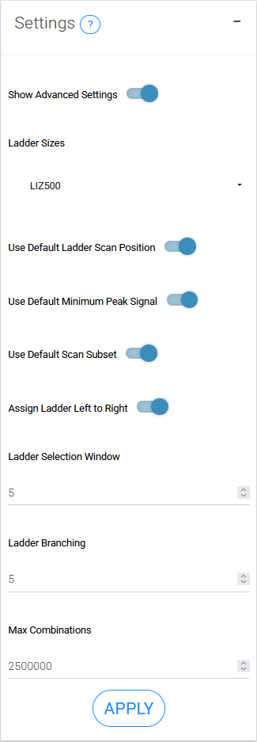

## STEP 2: FIND LADDERS
This step identifies the ladders in the ladder channel which is used to call the base pair size.

-   The ladder peaks are assigned from largest to smallest using the supplied ladder sizes.

-   Base pair sizes are assigned using the local Southern method. Basically, for each data point, linear models are made for the lower and upper 3 size standard and the predicted sizes are averaged. This means that it may not matter if the ladder is miss-assigned far away from you data signal.

-   Each ladder should be manually inspected to make sure that is has been correctly assigned.

### Ladder plots

{width=45%}


#### Select only samples with ladder warnings
Identifies samples with misaligned ladder sizes and ladder peaks. The threshold is dependent on the r-squared threshold for warning.

{width=45%}

#### Ladder R-squared Table
Table of R-squared values derived from a linear regression of data signal and size for every 3 consecutive ladder sizes. Values closer to 1 indicate a better fit.

#### Ladder Summary Table
Table of the average and minimum R-squared values of the Ladder R-squared table for each sample.

### Settings
{width=20%}

#### Ladder Sizes	
Base pair sizes of ladder used in fragment analysis.

#### Input Ladder Starting Scan Position	
Indicate the scan number to start looking for ladder peaks. Usually this can be automatically found (when set to NULL) since there's a big spike right at the start. However, if your ladder peaks are taller than the big spike, you will need to set this starting scan number manually.

#### Interactive ladder fixing
If the ladders are are not assigned correctly, you can interactively fix them.

{width=800px}

### Advanced Settings

#### Minimum Peak Signal	
Minimum height of peak from smoothed signal. Note that the smoothing applied to the signal lowers the value, so you need to select a value lower than what you see on the plot.

#### Scan Subset	
Filter the ladder and data signal between the selected scans (eg scan_subset = c(3000, 5000)).

#### Ladder Selection Window
In the ladder assigning algorithm, the we iterate through the scans in blocks and test their linear fit ( We can assume that the ladder is linear over a short distance) This value defines how large that block of peaks should be.

#### Ladder Assign Left to Right
Single logical for if the ladder should be assigned from the smallest base pair size to largest (TRUE), or if the order should be reversed and assigned from largest to smallest (FALSE), which can be helpful since the end often has cleaner signal than the start.

#### Ladder top n branching
The ladder assigning algorithm branches as it tests the various combinations. This value defines how many branches should be created. If the correct combination is not found, you could try increasing this value, but it will make it increasingly slower.

#### Ladder Branching r squared threshold
The branches of the ladder assigning algorithm are pruned by R-squared values above this threshold to discard fits that are not promising. If the correct combination is not found, you could try decreasing this value, but it will make it increasingly slower.

#### Max Combinations	
What is the maximum number of ladder combinations that should be tested.

#### Smoothing Window	
Ladder signal smoothing window size passed
```{r, include=FALSE}
#TOODO
#change how custom ladder input works


```
