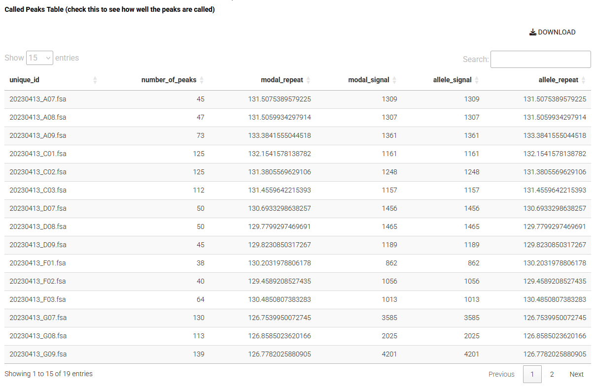
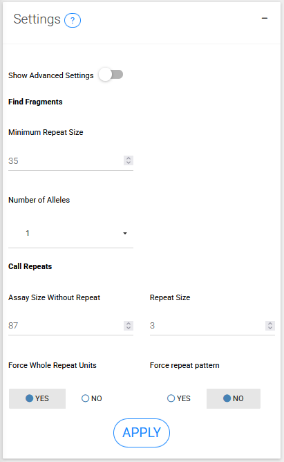

## STEP 3: FIND PEAKS
In the previous step we processed the raw data, now we need to extract fragment data. That involves finding peaks, finding alleles, and calling repeats. 

{width=800px}

#### Number of peaks
Total number of called peaks.

#### Modal repeat
The repeat size of the modal peak (tallest peak).

#### Modal signal
The data signal of the modal peak (tallest peak).

#### Allele signal
The data signal of the allele peak (for called alleles).

#### Allele repeat
The repeat size of the allele peak (for called alleles).

### Settings
{width=400px}


### Find fragments
This function simply finds the maxima in the continuous trace data to call peaks

If too many and inappropriate peaks are being called, this may also be solved with the different repeat calling algorithms in call repeats.

#### Minimum Repeat Size	
Minimum repeat size of peaks to consider

#### (advanced) Maximum Repeat Size	
Maximum repeat size of peaks to consider

#### (advanced) Smoothing Window
Signal smoothing window size passed to smoothing algorithm

#### (advanced) Minimum Peak Signal	
Minimum height of peak from smoothed trace

### Find Alleles
This function finds the main alleles for each fragment by identifying clusters of peaks ("peak regions") with the highest signal intensities. This is based on the idea that PCR amplicons of repeats have clusters of peaks (from somatic mosaicism and PCR artifacts) that help differentiate the main allele of interest from capillary electrophoresis noise/contamination.

The tallest of peaks will be selected as the allele. This means that if your sample has multiple alleles, you'll need to make sure that your data is subsetted to exclude that second allele. For example in a human cell line with a shorter repeat, we recommend using min bp size in find fragments to make sure that the smaller allele is excluded. Otherwise, the smaller taller allele will be set as the allele.

The parameters peak region height threshold multiplier and peak region size gap threshold will only need to be adjusted if peaks are not being found for some reason. They influence the criteria for identifying peak regions, and finding the right balance between them is crucial.

#### (advanced) peak region size gap threshold	
Gap threshold for identifying peak regions. The peak region size gap threshold is a parameter used to determine the maximum allowed gap between peak sizes within a peak region. Adjusting this parameter affects the size range of peaks that can be grouped together in a region. A smaller value makes it more stringent, while a larger value groups peaks with greater size differences, leading to broader peak regions that may encompass wider size ranges.

#### (advanced) peak region height threshold multiplier	
Multiplier for the peak height threshold. The peak region height threshold multiplier parameter allows adjusting the threshold for identifying peak regions based on peak heights. Increasing this multiplier value will result in higher thresholds, making it more stringent to consider peaks as part of a peak region. Conversely, reducing the multiplier value will make the criteria less strict, potentially leading to more peaks being grouped into peak regions. It's important to note that this parameter's optimal value depends on the characteristics of the data and the specific analysis goals. Choosing an appropriate value for this parameter can help in accurately identifying meaningful peak regions in the data.

### Call Repeats
This function has a lot of different options features for determining the repeat length of your samples. This includes i) an option to force the peaks to be whole repeat units apart, ii) corrections of batch effects or accurately calling repeat length by comparing to samples of known length, and iii) forcing repeat pattern by re-calling the peaks to remove any contaminating peaks or shoulder-peaks.
 
#### Assay Size Without Repeat	
An integer specifying the assay size without repeat for repeat calling. This is the length of the sequence flanking the repeat in the PCR product.

#### Repeat Size   	
An integer specifying the repeat size for repeat calling.

### Correction
There are two main correction approaches that are somewhat related: either 'batch' or 'repeat'. Batch correction is relatively simple and just requires you to link samples across batches to correct batch-batch variation in repeat sizes. However, even though the repeat size that is return will be precise, it will not be accurate and underestimates the real repeat length. By contrast, repeat correction can be used to accurately call repeat lengths (which also corrects the batch effects).
 
Batch correction uses common sample(s) across fragment analysis runs to correct systematic batch effects that occur with repeat-containing amplicons in capillary electrophoresis. There are slight fluctuations of size across runs for amplicons containing repeats that result in systematic differences around 1-3 base pairs. So, if samples are to be analyzed for different runs, the absolute bp size is not comparable unless this batch effect is corrected. This is only relevant when the absolute size of a amplicons are compared for grouping metrics as described above (otherwise instability metrics are all relative and it doesn’t matter that there’s systematic batch effects across runs) or when plotting traces from different runs. This correction can be achieved by running a couple of samples in every fragment analysis run, or having a single run that takes a couple of samples from every run together, thereby linking them. These samples are then indicated in the metadata with batch_run_id (to group samples by fragment analysis run) and batch_sample_id (to enable linking samples across batches).
 
Samples with known and validated repeat size can be used to accurately call the repeat length (and therefore also correct batch effects). Similar to batch correction, batch_run_id (to group samples by fragment analysis run) and batch_sample_id (to enable linking samples across batches) are used, but importantly batch_sample_modal_repeat is also set. The batch_sample_modal_repeat is the validated repeat length of the modal repeat of the sample. This validated repeat length is then used to call the repeat length of the modal repeat for each sample (by each batch_run_id). You can then visualize the batch_sample_id across runs and the model generated for each run to determine if the repeat correction has worked as expected.

#### Force Whole Repeat Units	
The `force_whole_repeat_units` option aims to correct for the systematic underestimation in fragment sizes that occurs in capillary electrophoresis. It is independent to the algorithms described above and can be used in conjunction. It modifies repeat lengths in a way that helps align peaks with the underlying repeat pattern, making the repeat lengths whole units (rather than ~0.9 repeats). The calculated repeat lengths start from the main peak's repeat length and increases in increments of the specified `repeat_size` in either direction. This option basically enables you to get exactly the same result as expansion_index values calculated from data from Genemapper.

#### force repeat pattern size peroid
This parameter re-calls the peaks based on specified (`force_repeat_pattern_size_period`) periodicity of the peaks. The main application of this algorithm is to solve the issue of contaminating peaks in the expected regular pattern of peaks. We can use the periodicity to jump between peaks and crack open a window (`force_repeat_pattern_scan_window`) to then pick out the tallest scan in the window.

#### (advanced) force_repeat_pattern_size_period	
A numeric value to set the peak periodicity bp size. In fragment analysis, the peaks are usually slightly below the actual repeat unit size, so you can use this value to fine tune what the periodicity should be.

#### (advanced) force_repeat_pattern_scan_window
A numeric value for the scan window when assigning the peak. When the scan period is determined, the algorithm jumps to the predicted scan for the next peak. This value opens a window of the neighboring scans to pick the tallest in.

```{r, include=FALSE}
#TOODO
#change how custom ladder input works


```
