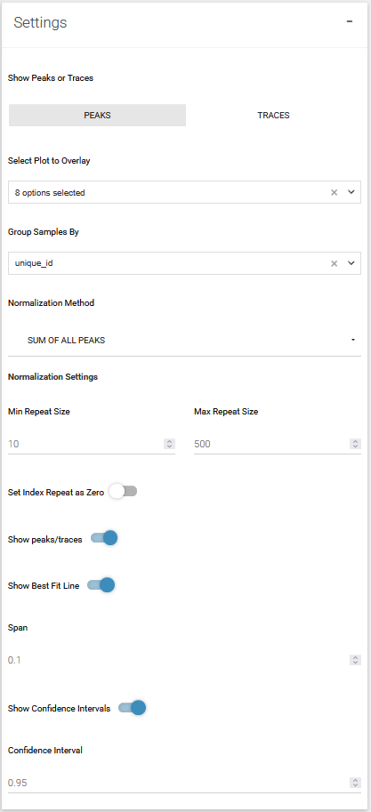

## STEP 5: FANCY PLOTS
traceShiny includes additional plotting features to show and overlay multiple traces.

### Settings

{width=400px}

#### Select plots to overlay
Select one or more plots to overlay

#### Group Samples by
Option to group samples by the additional details indicated in the metadata.

#### Normalization method
-  `None` No normalization method
-  `Highest Peak` Normalize by the highest peak in the given repeat size region (change with `Min Repeat Size` and `Max Repeat Size`)
-  `Sum of all peaks` Normalize by the sum of all peaks in the given repeat size region (change with `Min Repeat Size` and `Max Repeat Size`)

#### Set index peak as zero
Option to set index repeat as zero to allow easier comparisons between traces.

#### Show Best Fit line
Show the best fit line (loess moving regression, select higher Span values for smoother curves), can also toggle off and on the confidence interval.
