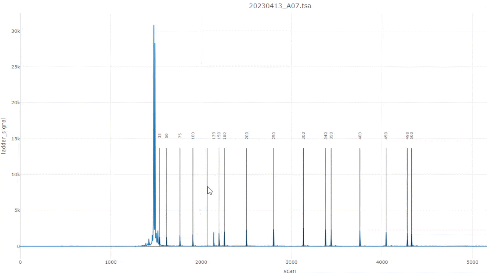

### Ladder plots

{width=100%}

#### Select only samples with ladder warnings
Identifies samples with misaligned ladder sizes and ladder peaks. The threshold is dependent on the r-squared threshold for warning.

{width=100%}

#### Ladder R-squared Table
Table of R-squared values derived from a linear regression of data signal and size for every 3 consecutive ladder sizes. Values closer to 1 indicate a better fit.

#### Ladder Summary Table
Table of the average and minimum R-squared values of the Ladder R-squared table for each sample.

### Interactive ladder fixing
If the ladders are are not assigned correctly, you can interactively fix them.

{width=800px}
