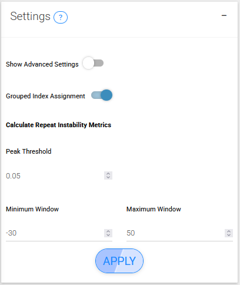
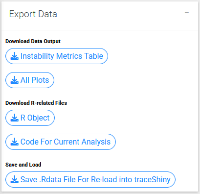

## STEP 4: CALCULATE INSTABILITY METRICS
In the previous steps we processed samples and collected all the information we need to now calculate instability metrics.

A key part of instability metrics is the index peak. This is the repeat length used as the reference peak for relative instability metrics calculations, like expansion index. This is usually the the inherited repeat length of a mouse, or the modal repeat length for the cell line at a starting time point.

If `metrics_group_id` and `metrics_baseline_control` are set in the metadata, we group the samples by their metrics_group_id and use the samples set as metrics_baseline_control to set the index peak. This is useful for cases like inferring repeat size of inherited alleles from mouse tail data. If the samples that are going to be used to assign index peak are from different fragment analysis runs, use batch_correction in call_repeats() to make sure the systematic differences between runs are corrected and the correct index peak is assigned. If there are multiple samples used as baseline control, the median value will be used to assign index peak to corresponding samples.

See the [calculate_instability_metrics() documentation](https://zachariahmclean.github.io/trace/reference/calculate_instability_metrics.html) in the trace package for a detailed explanation of each metric returned.

### Settings

{width=400px}

#### Grouped index assignment
A key part of instability metrics is the index peak. This is the repeat length used as the reference peak for relative instability metrics calculations, like expansion index. This is usually the the inherited repeat length of a mouse, or the modal repeat length for the cell line at a starting time point.

If grpuped index assignment is set, this function groups the samples by their `metrics_group_id` and uses the samples set as `metrics_baseline_control` to set the index peak. This is useful for cases like inferring repeat size of inherited alleles from mouse tail data. If the samples that are going to be used to assign index peak are from different fragment analysis runs, use batch or repeat correction to make sure the systematic differences between runs are corrected and the correct index peak is assigned. If there are multiple samples used as baseline control, the median value will be used to assign index peak to corresponding samples.

If grouped index assignment is not set, the modal peak will be used as the index peak.

#### peak threshold	
The threshold for peak heights to be considered in the calculations, relative to the modal peak height of the expanded allele.

#### window around index peak	
A numeric vector (length = 2) defining the range around the index peak. First number specifies repeats before the index peak, second after. For example, c(-5, 40) around an index peak of 100 would analyze repeats 95 to 140. The sign of the numbers does not matter (The absolute value is found).

#### (advanced) percentile range	
Generate a number sequence for computation of repeat expansion_percentile_*. e.g. from 0.5 to 0.95 by interval 0.05 enables computation of percentiles 0.50 0.55 0.60 0.65 0.70 0.75 0.80 0.85 0.90 0.95.

#### (advanced) repeat range	
A numeric vector specifying ranges of repeats for expansion_percentile_for_repeat_* computation. e.g. from 0.5 to 0.95 by interval 0.05 enables computation of percentiles 0 5 10 15 20.

### Export Data

{width=400px}

#### Instability metrics table
Download the instability metrics table as shown on the page.

#### All plots
Download the traces for each of the samples.

#### R object
Download the R object used to plot the traces and for analysis. This R-object is an R6 class object that may be further manipulated in R. Please refer to [trace documentation](https://github.com/zachariahmclean/trace)

#### Code for current analysis
Generates the code to reproduce the plots and instability metrics shown on the page using the trace R package.

#### Save .Rdata file for re-load into traceShiny
Downloads a .Rdata file that may be reloaded into traceShiny from the home page under CONTINUE.
