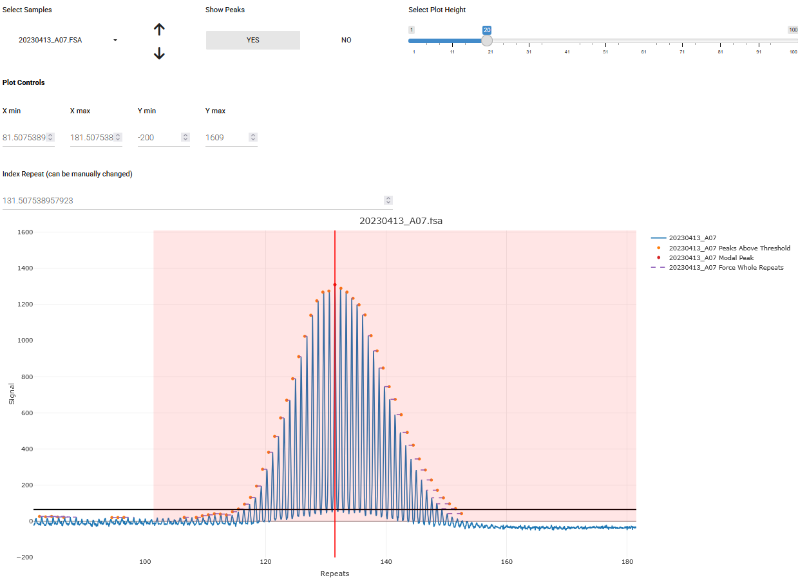

## STEP 4: CALCULATE INSTABILITY METRICS
In the previous steps we processed samples and collected all the information we need to now calculate instability metrics.

A key part of instability metrics is the index peak. This is the repeat length used as the reference peak for relative instability metrics calculations, like expansion index. This is usually the the inherited repeat length of a mouse, or the modal repeat length for the cell line at a starting time point.

If `metrics_group_id` and `metrics_baseline_control` are set in the metadata, we group the samples by their metrics_group_id and use the samples set as metrics_baseline_control to set the index peak. This is useful for cases like inferring repeat size of inherited alleles from mouse tail data. If the samples that are going to be used to assign index peak are from different fragment analysis runs, use batch_correction in call_repeats() to make sure the systematic differences between runs are corrected and the correct index peak is assigned. If there are multiple samples used as baseline control, the median value will be used to assign index peak to corresponding samples.

See the [calculate_instability_metrics() documentation](https://zachariahmclean.github.io/trace/reference/calculate_instability_metrics.html) in the trace package for a detailed explanation of each metric returned.

{width=800px}

#### Red vertical line
Index repeat, this can be manually changed.

#### Black horizontal line
The threshold for peak heights to be considered in the calculations, relative to the modal peak height of the expanded allele.
