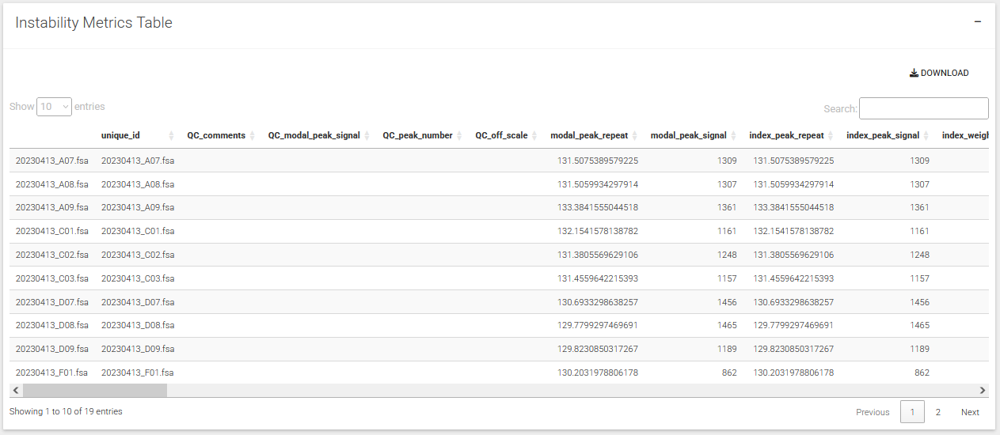

## Calculate Instability Metrics

{width=800px}

### General sample metrics

-  `modal_peak_repeat:` The repeat size of the modal peak.
-  `modal_peak_signal:` The signal of the modal peak.
-  `index_peak_repeat:` The repeat size of the index peak (the repeat value closest to the modal peak of the index sample).
-  `index_peak_signal:` The signal of the index peak.
-  `index_weighted_mean_repeat:` The weighted mean repeat size (weighted on the signal of the peaks) of the index sample.
-  `n_peaks_total:` The total number of peaks in the repeat table.
-  `n_peaks_analysis_subset:` The number of peaks in the analysis subset.
-  `n_peaks_analysis_subset_expansions:` The number of expansion peaks in the analysis subset.
-  `min_repeat:` The minimum repeat size in the analysis subset.
-  `max_repeat:` The maximum repeat size in the analysis subset.
-  `mean_repeat:` The mean repeat size in the analysis subset.
-  `weighted_mean_repeat:` The weighted mean repeat size (weight on peak signal) in the analysis subset.
-  `median_repeat:` The median repeat size in the analysis subset.
-  `max_signal:` The maximum peak signal in the analysis subset.
-  `max_delta_neg:` The maximum negative delta to the index peak.
-  `max_delta_pos:` The maximum positive delta to the index peak.
-  `skewness:` The skewness of the repeat size distribution.
-  `kurtosis:` The kurtosis of the repeat size distribution.

### Repeat instability metrics

-  `modal_repeat_change:` The difference between the modal repeat and the index repeat.
-  `average_repeat_change:` The weighted mean of the sample (weighted by peak signal) subtracted by the weighted mean repeat of the index sample(s).
-  `instability_index_change:` The instability index of the sample subtracted by the instability index of the index sample(s). This will be very similar to the average_repeat_change, with the key difference of instability_index_change being that it is an internally calculated metric for each sample, and therefore the random slight fluctuations of bp size (or systematic if across plates for example) will be removed. However, it requires the index peak to be correctly set for each sample, and if set incorrectly, can produce large arbitrary differences.
-  `instability_index:` The instability index based on peak signal and distance to the index peak. (See Lee et al., 2010, doi:10.1186/1752-0509-4-29 ).
-  `instability_index_abs:` The absolute instability index. The absolute value is taken for the "Change from the main allele".
-  `expansion_index:` The instability index for expansion peaks only.
-  `contraction_index:` The instability index for contraction peaks only.
-  `expansion_ratio:` The ratio of expansion peaks' signals to the main peak signal. Also known as "peak proportional sum" (See Genetic Modifiers of Huntington’s Disease (GeM-HD) Consortium, 2019, doi:10.1016/j.cell.2019.06.036 ).
-  `contraction_ratio:` The ratio of contraction peaks' signals to the main peak signal.
-  `expansion_percentile_*:` The repeat gain relative to the index peak at specified percentiles of the cumulative distribution of expansion peaks.
-  `expansion_percentile_for_repeat_*:` The percentile rank of specified repeat sizes in the distribution of expansion peaks.
