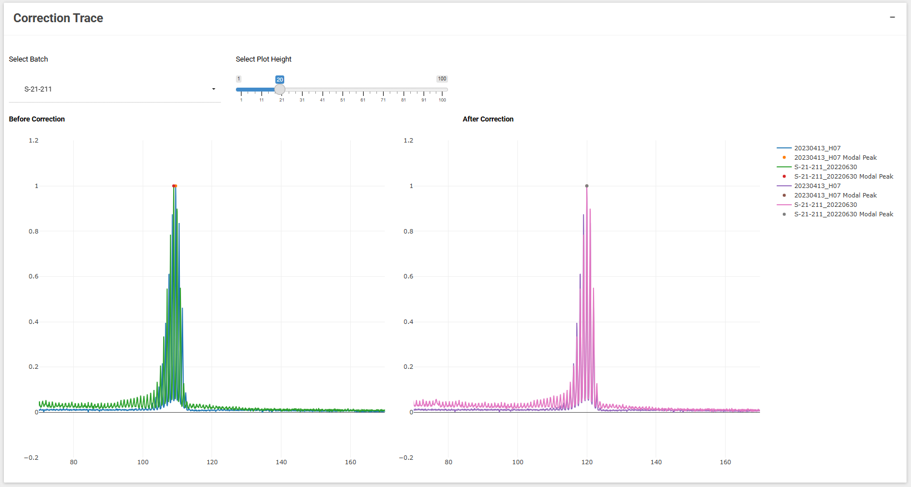

## Correction trace

{width=800px}

Before and after batch/repeat correction traces. The y-axis is the normalized data signal height for all samples in the batch. The after correction trace should have all plots overlayed on-top of each other.
