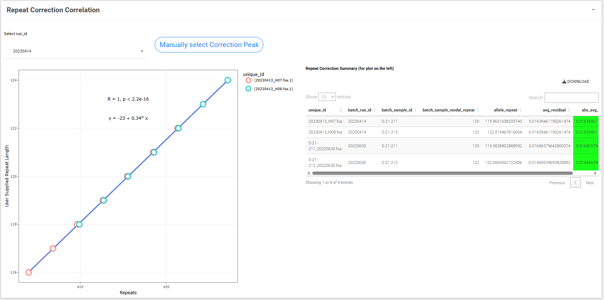

## Repeat correction correlation plot

{width=800px}

Linear model between ??

#### Manual peak correction
Users may select the correct modal peak in the repeat correction sample in the cases where there the two tallest peaks are at a similar height.
