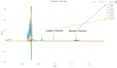

```{r setup, include=FALSE}
knitr::opts_chunk$set(echo = TRUE)
```

### Visualize signal in channels

Data in fsa files are stored in different channels depending on the instrument setup. We show a plot that visualizes the signal in all the channels. You may need to use the drop down menu to visualize the signals in different samples if it is not clear.



### Pick ladder and sample containing channels

In the drop down below, select the appropriate channels

-   Ladder: this signal is the internal base pair size standard. It is easily identifiable by the regular pattern of peaks. In the above example it is in the "DATA.105" channel.

-   Sample: the channel with the trace information for you samples should also be obvious with a distinctive trace pattern. In the above sample we can see a normal distribution of peaks in the DATA.1 channel.

```{r, include=FALSE}
#TOODO


```
